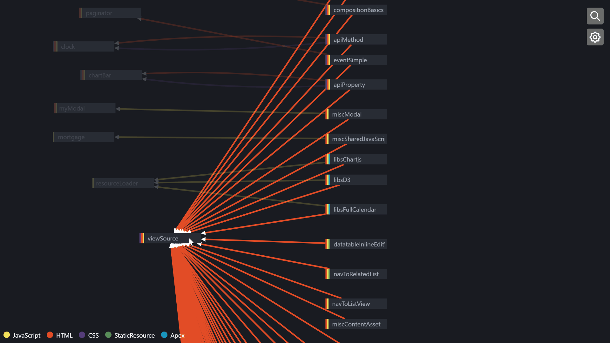
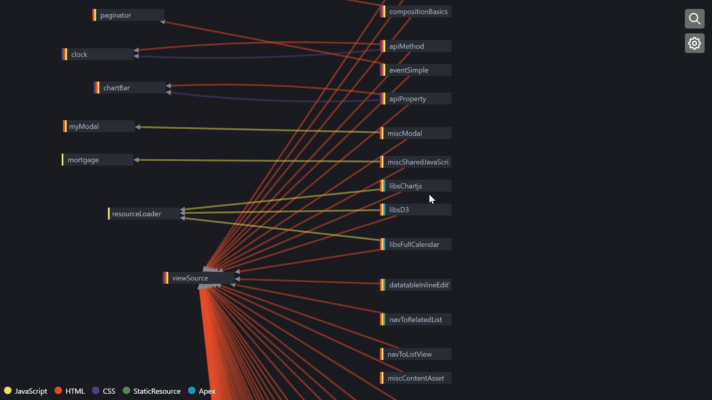
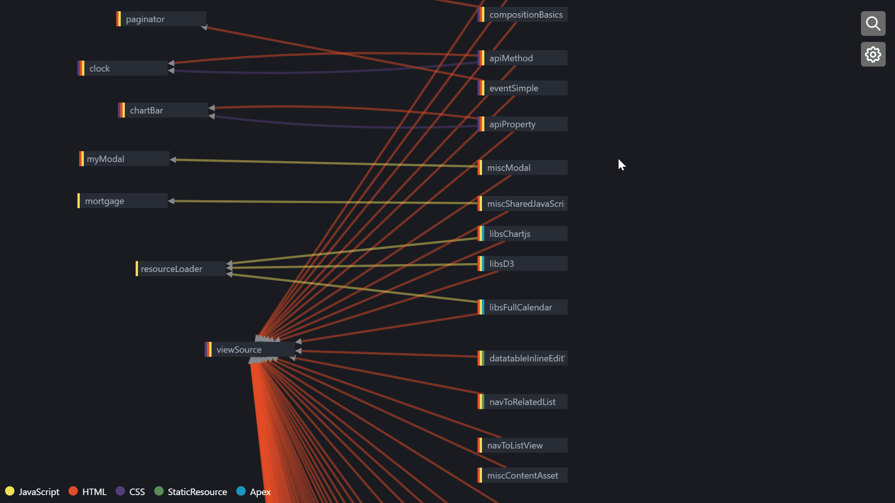
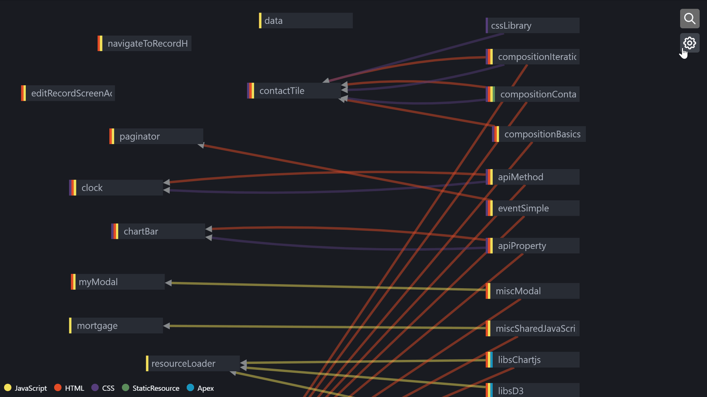
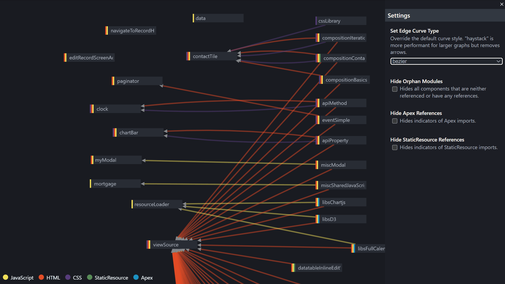

<p align="center">
  <a href="https://ldv.lukesecomb.digital" target="_blank" rel="noopener noreferrer">
    
  </a>
</p>
<h1 align="center">LWC Dependency Viewer</h1>
<br/>

- 🖼️ Visual representation of your LWCs
- 🔎 Component Search
- 💡 Highlight linked components
- 🔩 Indicators for LWC file types (HTML/JS/CSS)
- 📦 See which LWC are referencing Apex/StaticResources
- 🔑 Run locally without needing to install anything into your org

## Getting Started

```bash
pnpm install

# before running, open the `scripts/walk-files.ts` script and replace the 
# FOLDER_TO_SEARCH` value with your project path.
#
# pending https://github.com/lukethacoder/lwc-dependency-viewer/issues/1
pnpm walk

# run the dev server
pnpm dev

# this should open at http://localhost:5173/ 
```

> Default `output.json` has been generated from the [trailheadapps/lwc-recipes](https://github.com/trailheadapps/lwc-recipes) repository as an example usage.

## Screenshots

Hover LWC to see its neighbours

[](https://ldv.lukesecomb.digital)

Click an LWC to open up a file view and to see any related Apex Classes and/or StaticResource references

[](https://ldv.lukesecomb.digital)

Open up the search (keyboard shortcut `/`) and easily search for the LWC you're looking for.

[](https://ldv.lukesecomb.digital)

Hide orphan LWCs that exist on their own and don't relate to other LWCs

[](https://ldv.lukesecomb.digital)


Adjust the `curve-style` to your liking

[](https://ldv.lukesecomb.digital)


## Contribution

See [Contributing Guide](CONTRIBUTING.md).

## License

[MIT](LICENSE).
